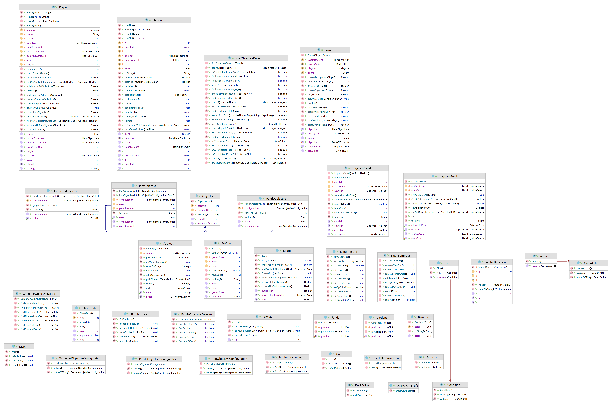

Réalisé par : Nina BOULTON - Clément CHATELAIN - Kaleb SIKA - Komi ASSIMPAH

# Introduction
Dans l'objectif de développer nos compétences en développement logiciel, nous avons eu à réaliser le jeu Takenoko en java. Takenoko est un jeu de stratégie et de gestion de jardin où chaque joueur doit gérer les ressources disponibles pour faire pousser les bambous et prendre soin du panda, tout en gardant à l'esprit les actions et les objectifs des autres joueurs.

## 1. Point d'avancement
### 1.1. Fonctionnalités
Dans notre version actuelle de Takenoko, nous avons implémenté toutes les règles du Takenoko, comprenant la pose des parcelles, les aménagements, l'irrigation, le déplacement du panda, la pousse des bambous. Nous avons également pris en compte le comportement du jardinier et le dé météo pour gérer les conditions climatiques.

### 1.2. Fonctionnalités non réalisées
Actuellement nos bots ne sont pas assez intelligent pour deviner les objectifs de leurs adversaires pour tenter de les saboter

### 1.3. Déroulement du jeu
Au debut du jeu, des bots (2, 3 ou 4) sont créés pour jouer selon une stratégie bien définie. Au fur et à mesure des tours, chaque joueur tente de réaliser un maximum d'objectifs pour gagner la partie. Ce nombre est déterminé en soustrayant à 11 le nombre de joueurs.

### 1.4. Réalisations des logs

### 1.5. Statistiques CSV
A la fin de chaque partie, les statiques des joueurs sont enregistré dans le fichier "gamestats.csv" du répertoire "stats". Ce fichier est mis à jour à la fin de chaque partie, et si ce fichier n'est pas encore, il est créé automatiquement par le programme.
Le fichier gamestats.csv enregistre pour chaque jouer, son nom, le nombre de parties jouées, le nombre de victoire et le nombre de défaites

### 1.6. Bot de la fonctionnalité additionnelles 3

#### 1.6.1. Conception du Bot

#### 1.6.2. Comparaison avec notre actuel meilleur bot

#### 1.6.3. Analyse du meilleur bot

## 2. Architecture et qualité

### 2.1. Architecture
Concernant l'architecture de notre projet, nous avons opté pour un système des Milestones et des issues. Chaque petite fonctionnalité répond à un besoin particulier et est utilisé pour créer des nouvelles fonctionnalités plus grande, pour permettre de réaliser l'application.

Les classes sont rangées dans des packages dont le titre résume leur fonctionnalité.

### 2.2. Qualité
Dans ce projet, nous avons utilisé les concepts de polymorphisme, abstraction, héritage, encapsulation ainsi que des types énumérés.

## 3. Déroulement du projet (Processus)

### 3.1. Rôles de chaque membre

### 3.2. Process de l'équipe

GitHub a été utilisé pour versionner et aussi planifié l'avancement du projet. Nous avons chacun crée notre propre branche pour coder, une autre branche commune a été créée et sur lequel était stockée les codes testés et fonctionnels. Autre branche (master) a été créé, c'est sur cette dernière qu'est posés les tags.

# Rétrospective
## Points à conserver
Pour réaliser ce projet, avoir une planification des tâches à éffectuer grâce à github nous a permis d'évoluer à différents niveaux du projet et donc de pas être resté bloqué sur une tâche.

## Points à changer
Notre plus grande erreur pendant ce projet aura de ne pas avoir pris le temps d'analyser l'architecture de notre application, ce qui aura causé une perte de temps pour les refactoring. La prochaine fois, il ne faudra donc tenir compte de cela.