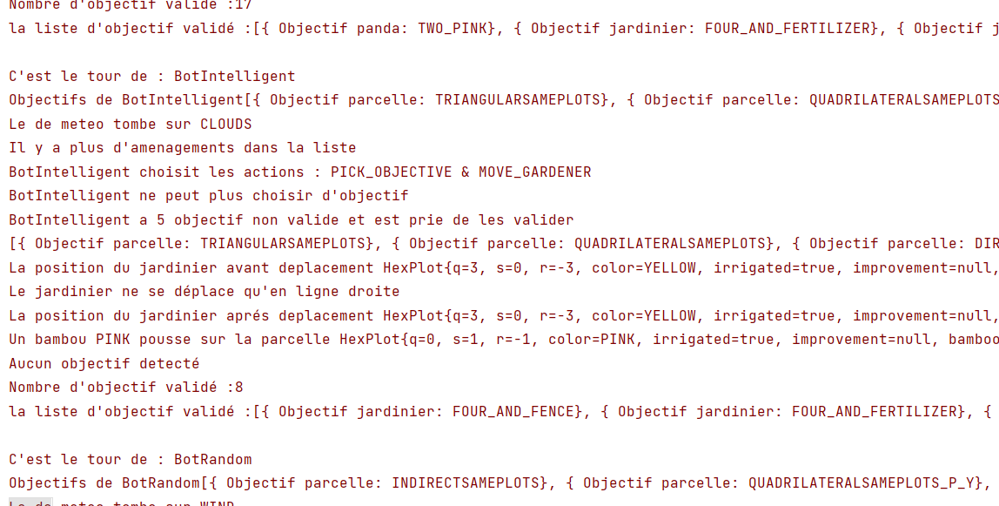

Réalisé par : Nina BOULTON - Clément CHATELAIN - Kaleb SIKA - Komi ASSIMPAH

# Introduction
Dans l'objectif de développer nos compétences en développement logiciel, nous avons eu à réaliser le jeu Takenoko en java. Takenoko est un jeu de stratégie et de gestion de jardin où chaque joueur doit gérer les ressources disponibles pour faire pousser les bambous et prendre soin du panda, tout en gardant à l'esprit les actions et les objectifs des autres joueurs.

## 1. Point d'avancement
### 1.1. Fonctionnalités
Dans notre version actuelle de Takenoko, nous avons implémenté toutes les règles du Takenoko, comprenant la pose des parcelles, les aménagements, l'irrigation, le déplacement du panda, la pousse des bambous. Nous avons également pris en compte le comportement du jardinier et le dé météo pour gérer les conditions climatiques.

### 1.2. Fonctionnalités non réalisées
Actuellement nos bots ne sont pas assez intelligent pour deviner les objectifs de leurs adversaires pour tenter de les saboter.

### 1.3. Déroulement du jeu
Au debut du jeu, des bots (2, 3 ou 4) sont créés pour jouer selon une stratégie bien définie. Au fur et à mesure des tours, chaque joueur tente de réaliser un maximum d'objectifs pour gagner la partie. Ce nombre est déterminé en soustrayant à 11 le nombre de joueurs.

### 1.4. Réalisation des logs
Au niveau des logs, on est assez satisfait de ce qu'on a effectué. On a utilisé principalement 2 niveaux de logs : INFO et SEVERE. Les logs INFO sont utilisés pour afficher toutes les informations importantes lors d'une partie. Les logs SEVERE sont utilisés pour afficher les résultats des joueurs lors de lancement de plusieurs parties. Dès le lancement du jeu, il y a des logs indiquant en détails la pose des parcelles, les objectifs accomplis et également les stratégies des bots pour gagner la partie.

### 1.5. Statistiques CSV
A la fin de chaque partie, les statiques des joueurs sont enregistré dans le fichier "gamestats.csv" du répertoire "stats". Ce fichier est mis à jour à la fin de chaque partie, et si ce fichier n'est pas encore, il est créé automatiquement par le programme.
Le fichier gamestats.csv enregistre pour chaque jouer, son nom, le nombre de parties jouées, le nombre de victoire, de parties nulles, de défaites ainsi que les points totaux marqués.

### 1.6. Bot de la fonctionnalité additionnelles 3

#### 1.6.1. Conception du Bot
Concernant le Bot de la fonctionnalité additionnelle 3, nous avons traité les 3 premieres fonctionnalités c'est à dire récuperer un maximum de bambous, avoir 5 objectifs en main et quand il tombe sur la météo ? il prend un irrigation. Cependant il ne se focalise pas sur plusieurs cartes à la fois ainsi qu'il ne surveille pas les mouvements de ses adversaires.

#### 1.6.2. Comparaison avec notre actuel meilleur bot
Notre meilleur Bot actuellement est celui qui suit la strategy PANDASTRATEGY car il est celui qui joue le plus en fonction du panda et donc qui représente vraiment un style de jeu. Cependant, il lui arrive de perdre contre le bot completement Random car il n'est pas assez intelligent.

#### 1.6.3. Analyse du meilleur bot
Le meilleur bot pour le moment est le bot de la fonctionnalité 3 car c'est celui qui a le plus souvent le winrate le plus élevé. Cependant, il n'est pas assez fort pour dominer en permanence ces adversaires.

## 2. Architecture et qualité

### 2.1. Architecture
Concernant l'architecture de notre projet, nous avons opté pour un système des Milestones et des issues. Chaque petite fonctionnalité répond à un besoin particulier et est utilisé pour créer des nouvelles fonctionnalités plus grande, pour permettre de réaliser l'application.

Les classes sont rangées dans des packages dont le titre résume leur fonctionnalité.

### 2.2. Qualité
Dans ce projet, nous avons utilisé les concepts de polymorphisme, abstraction, héritage, encapsulation ainsi que des types énumérés. Nous avons également utilisé des tests unitaires pour vérifier le bon fonctionnement de nos classes. Nous avons également utilisé des logs pour afficher les informations importantes lors d'une partie. Les noms des variables sont explicites.

## 3. Déroulement du projet (Processus)

### 3.1. Rôles de chaque membre
Au global, on a pas spécialement de rôles particuliers car on a tous traité plus au moins chaque partie du code que ce soit seul ou en pair progamming. On a beaucoup travaillé ensemble pour avoir des axes de reflexion différents et pouvoir ainsi avancer beaucoup plus vite.
Pour parler de cette semaine de rush, Nina a travaillé sur la fonctionnalité 1 et 3, Clément a travaillé sur la fonctionnalité 1 et 2, Kaleb et Komi a travaillé sur la fonctionnalité 2 et 3.

### 3.2. Process de l'équipe
Tout au long du projet, nous avons utilisé les issues pour planifier les tâches à effectuer et les milestones pour avoir des objectifs à valider chaque semaine. Nous avons donc pu se répartir les tâches à chaque fois que l'on se retrouvait en cours pour la semaine suivante. Nous avons chacun crée notre propre branche pour coder, une autre branche commune a été créée et sur lequel était stockée les codes testés et fonctionnels. Autre branche (master) a été créé, c'est sur cette dernière qu'est posés les tags.

# Rétrospective
## Points à conserver
Pour réaliser ce projet, avoir une planification des tâches à effectuer grâce à github nous a permis d'évoluer à différents niveaux du projet et donc de pas rester bloqué sur une tâche. On a appris à bien utiliser les branches pour éviter les conflits et c'était un de nos points forts lors de la réalisation de ce projet.

## Points à changer
Notre plus grande erreur pendant ce projet aura de ne pas avoir pris le temps d'analyser l'architecture de notre projet, ce qui aura causé une perte de temps pour les refactoring. La prochaine fois, il ne faudra donc tenir compte de cela.